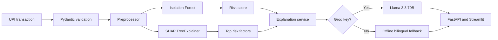

# FinGuard AI

Explainable UPI fraud detection for users, small merchants, and bank operations teams.

FinGuard AI scores a transaction with an Isolation Forest, identifies the strongest feature contributions with SHAP, and explains the alert in plain English or Hindi. The project runs fully offline for judging; adding a `GROQ_API_KEY` switches explanations to Llama 3.3 70B through Groq.

## What the MVP demonstrates

- Risk score from `0-100` with a calibrated fraud threshold.
- Seven behavioral inputs: amount, hour, merchant category, device change, location jump, transaction velocity, and new-merchant status.
- Top-three SHAP factors for every prediction.
- Feature-grounded English and Hindi explanations.
- Streamlit live feed, alert review, manual analysis, and seven-day analytics.
- FastAPI endpoints for prediction, explanation, model metrics, and demo data.
- Reproducible synthetic data, trained artifacts, Docker packaging, and automated tests.

## Quick start

Python 3.11 or 3.12 is recommended.

```powershell
python scripts/bootstrap.py
.\.venv\Scripts\python.exe -m streamlit run app.py
```

In a second terminal:

```powershell
.\.venv\Scripts\python.exe -m uvicorn api:app --reload
```

Open the dashboard at `http://localhost:8501` and API documentation at `http://localhost:8000/docs`.

For an existing environment:

```powershell
python -m pip install -r requirements-dev.txt
python generate_data.py
python train.py
python -m pytest
```

## Configuration

Copy `.env.example` to `.env`. `GROQ_API_KEY` is optional. Without it, the same SHAP factors are rendered through a deterministic bilingual explanation layer, so the demo never depends on network access.

Never commit `.env` or an API key.

## API example

```bash
curl -X POST http://localhost:8000/explain \
  -H "Content-Type: application/json" \
  -d '{
    "transaction_id": "DEMO-001",
    "amount": 45000,
    "hour": 2,
    "merchant_category": "electronics",
    "device_change": 1,
    "geo_distance_km": 850,
    "velocity_per_hour": 2,
    "is_new_merchant": 1,
    "language": "english"
  }'
```

## Architecture



## Evaluation

The included model was evaluated on a stratified 20% holdout from the generated 10,000-row synthetic dataset.

| Metric | Value |
|---|---:|
| Fraud F1 | 0.9975 |
| Fraud precision | 1.0000 |
| Fraud recall | 0.9950 |
| ROC-AUC | 0.9999 |
| Calibrated threshold | 60.25 |

These are prototype metrics on rule-generated synthetic patterns, not evidence of production bank performance. A real deployment requires institution-specific data, temporal validation, drift monitoring, human review, and RBI/NPCI-aligned controls.

## Project structure

```text
api.py                       FastAPI service
app.py                       Streamlit dashboard
generate_data.py             Synthetic UPI transaction generator
train.py                     Training, calibration, and held-out evaluation
predictor.py                 Inference and SHAP aggregation
groq_client.py               Groq integration and offline explanations
data/                        Generated dataset
models/                      Ready-to-run model artifacts and metrics
tests/                       Automated data, model, API, and language tests
docs/                        Technical, demo, and submission documentation
outputs/                     Final deck, document, and video deliverables
```

## Responsible use

FinGuard AI is a decision-support prototype. It does not initiate, approve, decline, reverse, or report a payment. Do not send UPI PINs, account identifiers, personal phone numbers, or raw bank data to the LLM. Production use should replace synthetic training data and add authentication, authorization, encryption, audit logging, rate limiting, data retention controls, bias testing, and incident response.

## Primary references

- [NPCI UPI product statistics](https://www.npci.org.in/what-we-do/upi/product-statistics)
- [Reserve Bank of India annual reports](https://www.rbi.org.in/Scripts/AnnualReportPublications.aspx)
- [SHAP documentation](https://shap.readthedocs.io/)
- [scikit-learn Isolation Forest](https://scikit-learn.org/stable/modules/generated/sklearn.ensemble.IsolationForest.html)

The numerical market-impact statements in the challenge brief should be checked against the latest NPCI and RBI releases immediately before submission.
