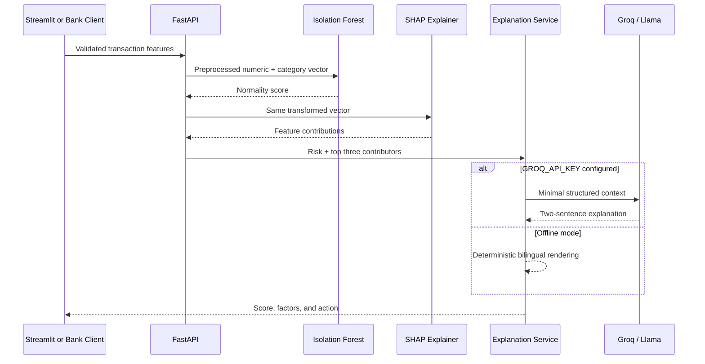

# FinGuard AI Technical Documentation

**Version:** 2.0.0  
**Prototype scope:** Explainable UPI transaction-risk monitoring  
**Audience:** Hackathon evaluators, engineers, product reviewers, and bank operations stakeholders

## 1. Executive summary

FinGuard AI turns a black-box fraud flag into an actionable user message. A transaction is validated, transformed into behavioral features, scored by an Isolation Forest, attributed with SHAP, and explained in English or Hindi. The same inference engine supports a FastAPI integration surface and a Streamlit dashboard.

The MVP is intentionally resilient for judging. It includes model artifacts and seeded suspicious transactions, and it generates faithful local explanations when no Groq key or network is available.

## 2. Goals and non-goals

### Goals

- Demonstrate real-time anomaly scoring and human-readable reasons.
- Preserve traceability from explanation text to model contribution.
- Support users who prefer Hindi without a separate translation service.
- Expose a clean API that can be integrated with an existing fraud stack.
- Remain reproducible from source with generated data and automated tests.

### Non-goals

- Connecting to live bank accounts or NPCI rails.
- Automatically declining, reversing, or reporting transactions.
- Claiming production fraud-detection performance from synthetic data.
- Processing UPI PINs, account numbers, phone numbers, or other secrets.

## 3. System architecture



### Components

| Component | Responsibility |
|---|---|
| `generate_data.py` | Creates normal behavior and four injected attack patterns. |
| `train.py` | Splits data, trains only on normal behavior, calibrates threshold on a holdout, evaluates, and persists artifacts. |
| `predictor.py` | Loads artifacts, scores a transaction, maps raw output to `0-100`, and aggregates SHAP values. |
| `groq_client.py` | Builds constrained prompts and provides a feature-grounded offline fallback. |
| `api.py` | Validates requests and exposes prediction, explanation, metrics, and demo endpoints. |
| `app.py` | Presents live feed, alerts, bilingual explanations, manual checks, and analytics. |

## 4. Data and features

The generated dataset contains 9,000 normal and 1,000 fraudulent records. Fraud is injected through four domain patterns: late-night high-value payments, device plus location jumps, rapid velocity attacks, and social-engineering payments to new merchants.

| Feature | Type | Meaning |
|---|---|---|
| `amount` | Float | Payment amount in INR. |
| `hour` | Integer | Local hour from 0 to 23. |
| `merchant_category` | Category | Ten demo merchant groups, one-hot encoded. |
| `device_change` | Binary | Device differs from the established fingerprint. |
| `geo_distance_km` | Float | Distance from the previous transaction location. |
| `velocity_per_hour` | Integer | Transactions observed in the current hour. |
| `is_new_merchant` | Binary | Merchant is new to the payer. |

`transaction_id`, `label`, and `fraud_pattern` are metadata and are never used as model inputs.

## 5. Training and evaluation

1. A stratified 80/20 split is created with random seed `42`.
2. Only normal rows from the training partition are used to fit preprocessing and Isolation Forest.
3. Numeric fields are standardized; merchant category is one-hot encoded.
4. Raw normality is converted to a `0-100` risk scale with headroom for severe anomalies.
5. Fraud labels in the held-out partition select the F1-maximizing threshold.
6. SHAP TreeExplainer is created for the fitted forest.

### Included artifact results

| Metric | Result |
|---|---:|
| Test rows | 2,000 |
| Test fraud rows | 200 |
| Fraud precision | 1.0000 |
| Fraud recall | 0.9950 |
| Fraud F1 | 0.9975 |
| ROC-AUC | 0.9999 |
| Threshold | 60.25 |

The near-perfect result is expected because synthetic fraud rules are deliberately separable for an MVP. It demonstrates implementation correctness, not external validity. Production evaluation should use time-based splits, institution data, precision at review capacity, alert rate, false-positive cost, demographic and regional slices, and post-deployment drift.

## 6. Explainability design

SHAP values are calculated in the transformed feature space. Numeric contributions map directly to their original field. All one-hot merchant-category contributions are summed into a single user-facing `merchant_category` contribution. Contributions are sorted by absolute magnitude and the top three are returned with:

- Raw and display values.
- English and Hindi labels.
- Signed SHAP value.
- A boolean indicating whether the contribution increases anomaly risk.

The LLM receives only the risk score and top risk indicators. The prompt forbids certainty and ML jargon. When Groq is unavailable, deterministic templates use those same factors, preventing a generic or fabricated explanation.

## 7. API contract

### `GET /health`

Reports service readiness, model availability, and whether explanation mode is Groq or offline.

### `GET /model/metrics`

Returns persisted training and held-out evaluation metadata.

### `POST /predict`

Returns risk score, level, decision, calibrated threshold, model version, and SHAP factors.

### `POST /explain`

Returns the prediction plus an English or Hindi explanation.

### `GET /demo/feed?n=15&fraud_ratio=0.35`

Returns a mixed synthetic feed with simulated ground truth for demonstrations.

Interactive OpenAPI documentation is generated automatically at `/docs`.

## 8. Security and privacy

The MVP implements strict numeric bounds, language allow-listing, limited CORS methods, no key logging, `.env` exclusion, and graceful LLM failure. The dashboard escapes LLM output before inserting it into HTML.

Production controls still required:

- OAuth2 or mTLS between bank services.
- Role-based access for users and analysts.
- Per-tenant rate limiting and abuse prevention.
- TLS, managed secrets, encryption at rest, and key rotation.
- Pseudonymous identifiers and minimal retention.
- Immutable audit records for model and analyst decisions.
- Model registry, approval workflow, rollback, and drift alarms.
- Human review for consequential payment action.

## 9. Scalability path

The API process loads model artifacts once, so prediction is CPU-local and does not require a database. Horizontal replicas can sit behind a load balancer. For higher volume, event ingestion can move to Kafka or a managed queue, inference can be isolated as a stateless service, and explanations can be generated only for flagged transactions. A feature store can maintain device, location, merchant, and velocity history. Redis can cache repeated explanation requests and enforce rate limits.

The current synchronous dashboard is for demonstration. A bank-scale architecture should separate transaction scoring, alert persistence, analyst review, and notification delivery.

## 10. Testing and operation

```powershell
python generate_data.py
python train.py
python -m pytest --cov
python scripts/smoke_test.py
```

The test suite covers dataset rules, zero-fraud demo batches, missing-field rejection, risk ordering, bilingual offline explanation grounding, API validation, and successful prediction.

### Failure modes

| Failure | Behavior |
|---|---|
| Model artifact missing | API returns `503`; dashboard shows setup instructions. |
| Groq key missing | Local bilingual explanation is used. |
| Groq timeout or malformed response | Local explanation is used without exposing internal errors. |
| Invalid transaction | Pydantic returns `422` before inference. |
| Unknown merchant category | Encoder ignores the unseen category; other signals still score. |

## 11. Deployment

The included `Dockerfile` serves FastAPI on `$PORT`; `render.yaml` provides a Render service definition. Streamlit Cloud can use `app.py` and `requirements.txt`. The model artifacts are committed for fast cold starts. A production system should store versioned artifacts in managed object storage and verify their hashes at startup.

No hosted demo URL is included in this submission package.

## 12. Limitations and next steps

- Replace synthetic data with de-identified, consented institution data.
- Add temporal account context rather than relying on request-supplied deltas.
- Evaluate calibration and false positives across regions and merchant segments.
- Add authentication, case management, alert acknowledgment, and audit export.
- Load-test prediction and explanation paths independently.
- Add WhatsApp only after consent, template approval, and privacy review.

## References

- NPCI, [UPI product statistics](https://www.npci.org.in/what-we-do/upi/product-statistics).
- RBI, [Annual report publications](https://www.rbi.org.in/Scripts/AnnualReportPublications.aspx).
- scikit-learn, [IsolationForest](https://scikit-learn.org/stable/modules/generated/sklearn.ensemble.IsolationForest.html).
- SHAP, [documentation](https://shap.readthedocs.io/).
- FastAPI, [documentation](https://fastapi.tiangolo.com/).

Market figures supplied in the challenge brief should be rechecked against the latest NPCI and RBI releases before final upload.
